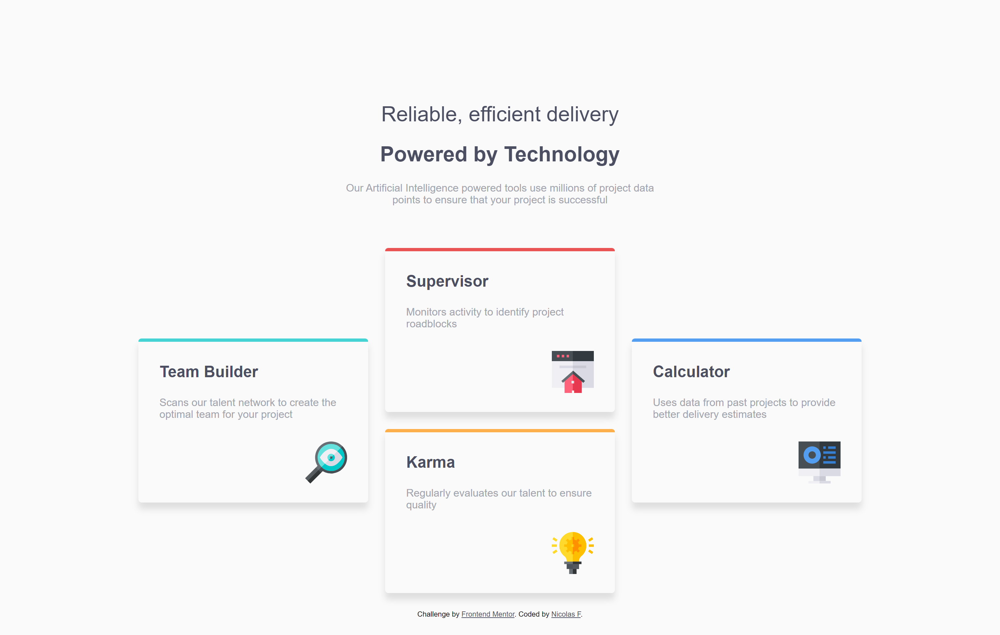

# Frontend Mentor - Four card feature section solution

This is a solution to the [Four card feature section challenge on Frontend Mentor](https://www.frontendmentor.io/challenges/four-card-feature-section-weK1eFYK). Frontend Mentor challenges help you improve your coding skills by building realistic projects.

## Table of contents

- [Overview](#overview)
  - [The challenge](#the-challenge)
  - [Screenshot](#screenshot)
  - [Links](#links)
- [My process](#my-process)
  - [Built with](#built-with)
  - [What I learned](#what-i-learned)
  - [Continued development](#continued-development)
  - [Useful resources](#useful-resources)
- [Author](#author)
- [Acknowledgments](#acknowledgments)

**Note: Delete this note and update the table of contents based on what sections you keep.**

## Overview

### The challenge

Users should be able to:

- View the optimal layout for the site depending on their device's screen size

### Screenshots

#### Desktop



#### Mobile


### Links

- Solution URL: [Code](https://github.com/nicolasfig/four-card-feature-section-master)
- Live Site URL: [Live site](https://nicolasfig.github.io/four-card-feature-section-master/)

## My process

### Built with

- Semantic HTML5 markup
- CSS custom properties
- Flexbox
- CSS Grid

### What I learned

I learned some flexbox, basically building upon previous projects
Also I'm getting better at using rems instead of pixels

```css
.card-content .icon {
  display: flex;
  justify-content: flex-end;
  margin-top: var(--large-1);
}
```

### Useful resources

- [Flexbox Malven](https://flexbox.malven.co/) - Useful flexbox reference as always
- [MDN](https://developer.mozilla.org/en-US/) - MDN the best documentation

## Author

- Frontend Mentor - [@nicolasfig](https://www.frontendmentor.io/profile/nicolasfig)
